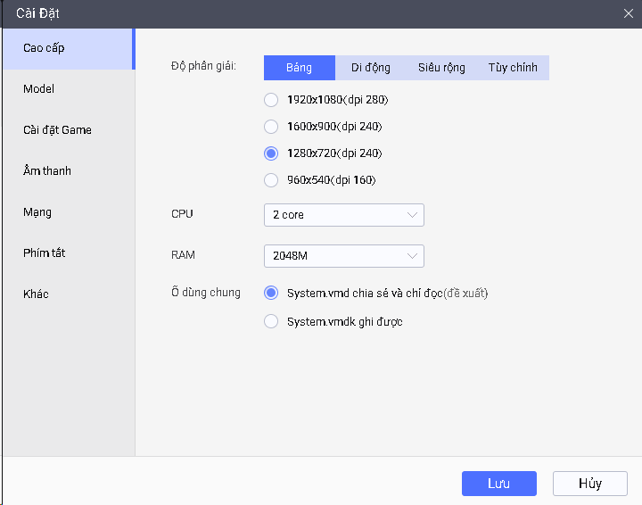
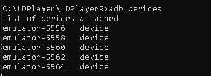
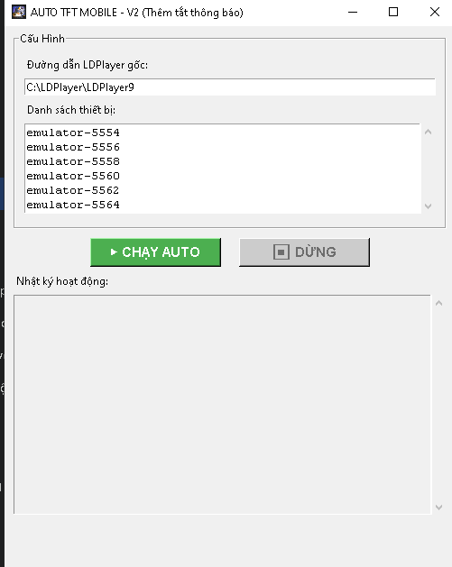
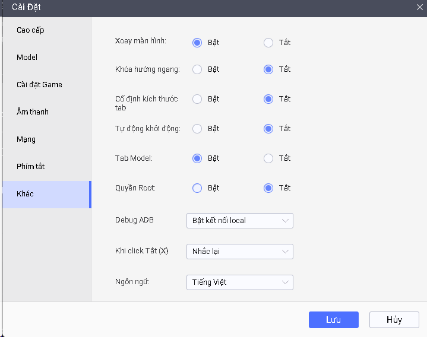

# 🏆 Auto TFT Mobile - Bot Cày Vé Pass Tự Động (Final Version)

Tool tự động hóa chơi Đấu Trường Chân Lý (TFT) Mobile trên giả lập LDPlayer sử dụng Python, ADB và xử lý ảnh (OpenCV). Phiên bản tối ưu hóa tốc độ và khả năng tự phục hồi lỗi.

## 🚀 Tính Năng Nổi Bật
- **🔄 Smart Recovery (Tự phục hồi):** Tự động phát hiện lỗi "Mất kết nối", "Lỗi đăng nhập" để buộc dừng (Force Stop) game và mở lại từ đầu.
- **⚡ Speed Mode (Tốc độ cao):** Giảm thời gian chờ, bot phản xạ chọn trận và chấp nhận trận đấu ngay lập tức.
- **🛠️ Xử lý OpenGL/Update:** Tự động phát hiện bảng thông báo OpenGL hoặc Cập nhật để xử lý ngay sau 5 giây (không chờ mù 40s như cũ).
- **🎮 Chọn Chế Độ Thông Minh:** Ưu tiên **Chế độ Mới** -> Nếu không có sẽ chọn **Chế độ Thường**.
- **💻 Đa Luồng (Multi-threading):** Hỗ trợ chạy song song nhiều thiết bị giả lập cùng lúc.
- **⚙️ Cấu hình JSON:** Quản lý danh sách thiết bị và cài đặt qua file `config.json` tiện lợi.

---

## 🛠️ Yêu Cầu Cài Đặt

1. **[LDPlayer 9](https://vn.ldplayer.net/):** Giả lập Android (Bắt buộc).
2. **[Python 3.10+](https://www.python.org/downloads/):** Tích chọn **"Add Python to PATH"** khi cài.
3. **Thư viện Python:**
   ```bash
   pip install opencv-python numpy
⚙️ Cấu Hình Giả Lập (QUAN TRỌNG)
Để Bot hoạt động chính xác 100%, hãy cài đặt LDPlayer như sau:
Mục,Cài đặt,Lý do
Độ phân giải,1280x720 (dpi 240),Để khớp với ảnh mẫu nhận diện.
ADB Debugging,Open Connection (Bật),Để tool gửi lệnh điều khiển.
CPU/RAM,2 Cores / 3GB RAM,Cấu hình tối ưu để treo nhiều tab nhẹ máy.
Root,Tắt (Không cần thiết),Tránh các lỗi bảo mật game.

Tool tự động hóa chơi Đấu Trường Chân Lý (TFT) Mobile trên giả lập LDPlayer sử dụng Python, ADB và xử lý ảnh (OpenCV). Phiên bản tối ưu hóa tốc độ và khả năng tự phục hồi lỗi.
📂 Cấu trúc Thư mục & Ảnh Mẫu
Đảm bảo thư mục bot có đủ các file ảnh .png sau (cắt từ màn hình giả lập):

Nhóm Lỗi & Hệ thống: loi_ket_noi.png, icon_game.png, nut_cap_nhat.png, nut_ok_opengl.png, nut_mo_game.png.

Nhóm Sảnh: find_match.png (Nút Chơi xanh), nut_che_do_moi.png, nut_che_do_thuong.png, nut_quay_lai.png.

Nhóm Trong Game: accept.png, nut_doi.png, surrender_btn.png, confirm_surrender.png.

Nhóm Popup & Thoát: nut_dong_popup.png, nut_thoat_1.png...

📝 Cách Sử Dụng
Lấy danh sách thiết bị: Mở CMD, gõ: adb devices

Cấu hình config.json: Tool sẽ tự tạo file này khi chạy lần đầu. Bạn mở lên và điền tên thiết bị:
{
    "LDPLAYER_PATH": "C:\\LDPlayer\\LDPlayer9",
    "LIST_DEVICES": ["emulator-5554", "emulator-5556"]
}
Chạy Tool: multi_main.exe

📅 Changelog (Lịch sử cập nhật)
[24/01/2026] - Bản cập nhật "Auto Restart & Smart Wait"
Tính năng mới: Thêm hàm force_stop_game để tắt hẳn ứng dụng khi gặp lỗi kết nối (khắc phục lỗi kẹt nút "Thử lại").

Tối ưu: Sửa logic khởi động game: Bấm icon game -> Chờ 5s -> Check OpenGL/Update ngay (Thay vì ngủ 40s gây lãng phí thời gian).

Sửa lỗi: Cập nhật tên gói (Package Name) chính xác cho bản VNG và Riot Quốc tế.

[23/01/2026] - Bản cập nhật Speed & Logic
Tối ưu: Giảm độ trễ vòng lặp xuống 1s để tăng tốc độ phản xạ.

Sửa lỗi: Fix lỗi vòng lặp vô tận khi chọn chế độ.

Tính năng: Tự động reset sảnh (nút Back) nếu kẹt nút tìm trận quá 60s.

⚠️ Lưu ý
Tool chỉ phục vụ mục đích học tập và hỗ trợ cày vé Pass (Battle Pass).

Nếu gặp lỗi "ADB Offline": Hãy tắt/bật lại ADB Debugging trong cài đặt LDPlayer.
